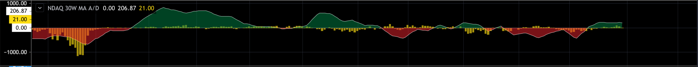
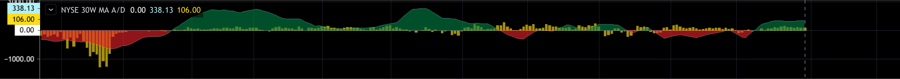
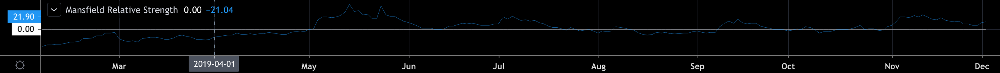
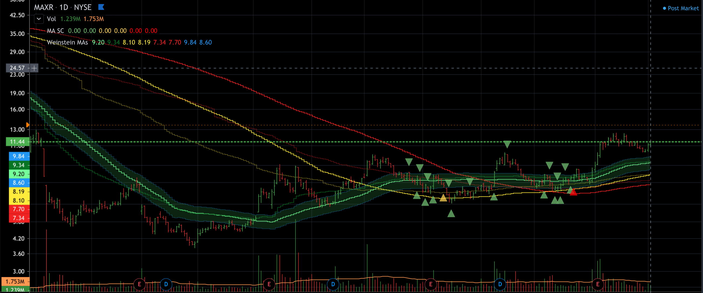
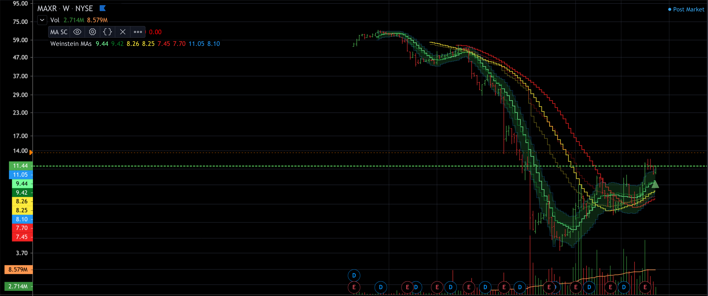

Porting Stan Weinstein to Tradingview.com PineScript

This repo contains four PineScript indicators helpful for implementing Stage
Analysis as described by Stan Weinstein in his seminal guide on trend trading. 

**`nasdaq.pine`**  
Nasdaq 30 Week Moving Average Of The Advance Decline Ratio  
Overlayed with a bar chart of the number of new 52 week highs or 52 week lows.  
A bar chart below the zero lines more issues made 52 week lows and vice versa.  

**`nyse.pine`**  
NYSE 30 Week Moving Average Of The Advance Decline Ratio  
Overlayed with a bar chart of the number of new 52 week highs and lows.  

**`mansfield.pine`**  
Mansfield Relative Strength which works uses Nasdaq Composite, NYSE Composite, ARCA Composite, and
Coinbase BTCUSD for it's alpha measure for stocks and crypto respectively. 

**`weinstein.pine`**  
This is a set of moving averages. In a weekly chart, it's the 10, 30, and 40 period moving averages.  
In all other interval sizes it's the 50, 150, and 200 period moving averages.  
It includes volume adjusted lines as well as an Average True Range indciated around the shortest interval moving average in the chart.  
** Daily **  

** Weekly **  

